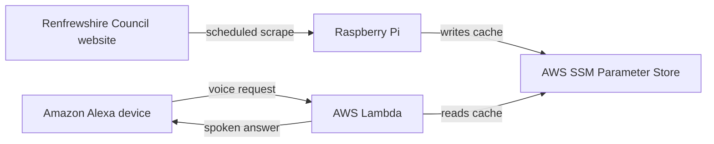

# Renfrew-Yoker Bridge Checker

Check when the **Renfrew-Yoker bridge** is closed by asking **Amazon Alexa**.

Renfrewshire Council publish bridge closure times on their website at the following
page: https://www1.renfrewshire.gov.uk/article/14478/Check-when-Renfrew-Bridge-is-closed-to-vehicles-pedestrians-and-cyclists

---

## Table of Contents

- [How it works](#how-it-works)
- [Requirements](#requirements)
- [Installation](#installation)
- [Running the tests](#running-the-tests)
- [Tooling](#tooling)
- [Deployment](#deployment)
- [Contributing](#contributing)

---

## How it works

A few constraints shaped the design:

- **Renfrewshire council does not publish the required data via an API.** At the time of
  developing this project, there is no API for bridge closure data, only an HTML page,
  so an automated check must scrape it.
- **Alexa allows 8 seconds to respond.** Scraping a live page inside the voice request
  service is too slow and too fragile. Caching the result decouples response latency
  from scrape latency entirely.
- **Renfrewshire council's website sits behind Cloudflare.** Requests from AWS's
  datacenter IP ranges get blocked. A Raspberry Pi on a residential connection is
  treated as ordinary traffic, which removes the need for a scraping proxy.
- **A scraping proxy was the first attempt, and it wasn't viable.** ScraperAPI bills 40
  credits per Cloudflare-protected fetch rather than 1, so the free tier ran dry at any
  useful refresh cadence. The Raspberry Pi replaced it and costs virtually nothing to
  run.



A Raspberry Pi on home broadband scrapes the bridge closures page every fifteen minutes
and writes the parsed closures to **AWS SSM Parameter Store** - a managed key-value
store, used here purely as a small, durable cache. The Alexa-facing Lambda only ever
reads that cache.

The scheduled scrape and the voice handler are deliberately kept as separate
deployables. They fail independently: a scrape that breaks leaves the last good cache in
place, and Alexa keeps answering.

---

## Requirements

- [Git](https://git-scm.com/downloads)
- [Python 3.14](https://www.python.org/downloads/)

---

## Installation

```bash
# Clone the repository:
git clone https://github.com/gregor-mcintyre/renfrew-yoker-bridge-checker.git

# Create a virtual environment:
py -3.14 -m venv .venv

# Activate the virtual environment depending on your operating system:
.venv\Scripts\activate # Windows
source .venv/bin/activate # macOS/Linux

# Install the project's development dependencies:
pip install -e ".[dev]"

# Wire up git hooks so linting/formatting/type-checks run on every commit:
pre-commit install
```

---

## Running the tests

Tests are split into unit, integration and end-to-end tiers. The conventions behind that
split are documented in `tests/CLAUDE.md`, which is also where the canonical commands
live if these drift.

```bash
# The whole test suite:
pytest

# A single tier:
pytest tests/unit
pytest tests/integration
pytest tests/e2e

# A single file:
pytest tests/unit/raspberry_pi/bridge_closures/test_parsing.py

# A single test:
pytest -k test_parses_a_single_closure
```

### Test Coverage

Coverage reports show how much of the codebase is exercised by tests. Generate coverage
with `pytest-cov`:

```bash
# Coverage for the whole test suite, printed to the terminal:
pytest --cov=shared --cov=raspberry_pi --cov=alexa_lambda

# Coverage with an HTML report (open htmlcov/index.html in a browser):
pytest --cov=shared --cov=raspberry_pi --cov=alexa_lambda --cov-report=html

# Coverage for a single tier:
pytest tests/unit --cov=shared --cov=raspberry_pi --cov=alexa_lambda
```

---

## Tooling

On every `git commit`, Ruff (lint + format), mypy (type-checking) and vulture (dead
code) run automatically via pre-commit. They report issues without auto-fixing. If a
hook fails, fix the flagged lines by hand, then re-commit.

```bash
# Run every hook manually against all files:
pre-commit run --all-files
```

Actual settings live in `pyproject.toml` and `.pre-commit-config.yaml`. See `CLAUDE.md`
for the naming and docstring conventions this project follows, and `tests/CLAUDE.md`
for the testing ones.

---

## Deployment

# TODO: Fill this section in once deployment is underway.

---

## Contributing

This project uses the **Git Flow** branching model. See
[CONTRIBUTING.md](CONTRIBUTING.md) for the branch structure, the workflow for features,
releases and hotfixes, and how to get `git-flow` installed.

Code conventions - naming, docstrings, testing and commit messages - are documented in
[CLAUDE.md](CLAUDE.md).
