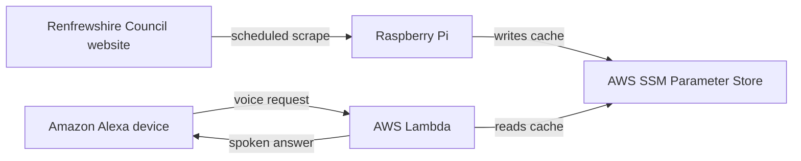

# Renfrew-Yoker Bridge Checker

Check when the **Renfrew-Yoker bridge** is closed by asking **Amazon Alexa**.

Renfrewshire Council publish bridge closure times on their website at the following
page: https://www1.renfrewshire.gov.uk/article/14478/Check-when-Renfrew-Bridge-is-closed-to-vehicles-pedestrians-and-cyclists

---

## Table of Contents

- [How it works](#how-it-works)
- [Requirements](#requirements)
- [Installation](#installation)
- [Running the scrape](#running-the-scrape)
- [Running the tests](#running-the-tests)
- [Tooling](#tooling)
- [Deployment](#deployment)
- [Contributing](#contributing)

---

## How it works

A few constraints shaped the design:

- **Renfrewshire council does not publish the required data via an API.** At the time of
  developing this project, there is no API for bridge closure data, only an HTML page,
  so an automated check must scrape it.
- **Alexa allows 8 seconds to respond.** Scraping a live page inside the voice request
  service is too slow and too fragile. Caching the result decouples response latency
  from scrape latency entirely.
- **The Renfrewshire council website sits behind Cloudflare.** Cloudflare answers a
  client with a JavaScript challenge instead of the page unless the connection looks
  like one from a browser, whatever User-Agent header it sends. The scrape uses
  `curl_cffi` to connect with the fingerprint of a real browser, and runs on a Raspberry
  Pi on home broadband rather than in AWS, because requests from datacenter IP ranges
  are still likely to be blocked.
- **A scraping proxy was the first attempt, and it wasn't viable.** ScraperAPI bills 40
  credits per Cloudflare-protected fetch rather than 1, so the free tier ran dry at any
  useful refresh cadence. The Raspberry Pi replaced it and costs virtually nothing to
  run.



A Raspberry Pi on home broadband scrapes the bridge closures page every fifteen minutes
and writes the parsed closures to **AWS SSM Parameter Store** - a managed key-value
store, used here purely as a small, durable cache. The Alexa-facing Lambda only ever
reads that cache.

The scheduled scrape and the voice handler are deliberately kept as separate
deployables. They fail independently: a scrape that breaks leaves the last good cache in
place, and Alexa keeps answering.

---

## Requirements

- [Git](https://git-scm.com/downloads)
- [Python 3.14](https://www.python.org/downloads/)

---

## Installation

```bash
# Clone the repository:
git clone https://github.com/gregor-mcintyre/renfrew-yoker-bridge-checker.git
cd renfrew-yoker-bridge-checker

# Create a virtual environment depending on your operating system:
py -3.14 -m venv .venv # Windows
python3.14 -m venv .venv # macOS/Linux

# Activate the virtual environment depending on your operating system:
.venv\Scripts\activate # Windows
source .venv/bin/activate # macOS/Linux

# Install the project's development dependencies:
pip install -e ".[dev]"

# Wire up git hooks so linting/formatting/type-checks run on every commit:
pre-commit install
```

---

## Running the scrape

The scrape the Raspberry Pi runs on a timer can also be run manually on Windows, macOS
or Linux - it is the same command the Pi's systemd service runs. Each run ends by
writing the closures to AWS.

### 1. Create an AWS account

Sign up at [aws.amazon.com](https://aws.amazon.com/) with **Create an AWS Account**.
It asks for an email address, a password, a payment card and a phone number, and
choose **Basic support – Free** when asked. The email and password you sign up with
are the **root user** - the all-powerful owner of the account - so keep them for account
administration like the steps below, never for the scrape itself.

Two safety nets are worth setting up straight away:

- **Multi-factor authentication (MFA) for the root user** - under your account name at
  the top right, **Security credentials** → **Assign MFA device**.
- **A spending alert** - search the console for **Budgets** and create one from the
  **Zero spend budget** template, which emails you if anything ever starts costing
  money.

### 2. Choose the region

AWS is split into regions - separate groups of data centres - and the cache lives in
exactly one. Use **Europe (Ireland) `eu-west-1`**, the European region Alexa skills run
their Lambda in; the Lambda will read the cache from its own region. Pick it from the
region menu at the top right of the console so you can find the cache later.

### 3. Create a user for the scrape

The scrape should not use your root login. Instead, give it an **IAM user** - a login
for a program, not a person, that is allowed to do one thing only.

1. Open **IAM** → **Users** → **Create user**. Name it
   `renfrew-yoker-bridge-checker-raspberry-pi`, leave console access off, and create it
   without choosing any permissions.
2. On the new user, open **Permissions** → **Add permissions** → **Create inline
   policy**, switch the editor to **JSON**, and paste the policy below. It allows
   writing parameters under `/renfrew-yoker-bridge-checker/` - the prefix of
   `PARAMETER_NAME` in `shared/closure_cache.py` - in Ireland, and nothing else. The `*`
   in place of an account ID grants nothing extra: the user can only ever write
   parameters in the account it belongs to.

   ```json
   {
     "Version": "2012-10-17",
     "Statement": [
       {
         "Effect": "Allow",
         "Action": "ssm:PutParameter",
         "Resource": "arn:aws:ssm:eu-west-1:*:parameter/renfrew-yoker-bridge-checker/*"
       }
     ]
   }
   ```

### 4. Create an access key

An **access key** is the username and password the scrape logs in with. On the user,
open **Security credentials** → **Create access key**, and choose *Application running
outside AWS* as the use case. AWS shows the **secret access key** only once, so keep the
page open until the next step is done - if it is lost, create a new key and delete the
old one. Create one key per machine (a user can hold two) so either can be revoked on
its own, and never commit a key or paste it anywhere else.

### 5. Store the key on your machine

`boto3` reads the key and region from two files in a `.aws` folder in your home
directory - `~/.aws` on macOS/Linux, `%USERPROFILE%\.aws` on Windows. Create the folder,
then the two files with a plain-text editor, with no file extension:

`credentials`, holding the key:

```ini
[default]
aws_access_key_id = <access-key-id>
aws_secret_access_key = <secret-access-key>
```

`config`, holding the region:

```ini
[default]
region = eu-west-1
```

On macOS and Linux, `chmod 600 ~/.aws/credentials` keeps the key readable by you alone.
If the machine already has a `default` profile for other work, name the sections
`[bridge-checker]` in `credentials` and `[profile bridge-checker]` in `config` instead,
and set `AWS_PROFILE` to `bridge-checker` alongside `PYTHONPATH` below.

To check the key works, ask AWS who it is - this needs no permissions, and prints the
user created in step 3:

```bash
python -c "import boto3; print(boto3.client('sts').get_caller_identity()['Arn'])"
```

### 6. Run the scrape

From the repository root, with `.venv` activated:

```bash
# Put the two directories the scrape imports from on the module search path,
# depending on your operating system:
$env:PYTHONPATH = "shared;raspberry_pi" # Windows (PowerShell)
export PYTHONPATH=shared:raspberry_pi # macOS/Linux

# Run the scrape:
python -m bridge_closures
```

There is no need to create the parameter in Parameter Store by hand: the first
successful run creates it, and later runs overwrite it. To see it, open **Systems
Manager** → **Parameter Store** in the console with Ireland selected.

---

## Running the tests

Tests are split into unit, integration and end-to-end tiers. The conventions behind that
split are documented in `tests/CLAUDE.md`, which is also where the canonical commands
live if these drift.

```bash
# The whole test suite:
pytest

# A single tier:
pytest tests/unit
pytest tests/integration
pytest tests/e2e

# A single file:
pytest tests/unit/raspberry_pi/bridge_closures/test_parsing.py

# A single test:
pytest -k test_returns_empty_list_when_no_date_heading_is_found
```

### Test Coverage

Coverage reports show how much of the codebase is exercised by tests. Generate coverage
with `pytest-cov`:

```bash
# Coverage for the whole test suite, printed to the terminal:
pytest --cov

# Coverage with an HTML report (open htmlcov/index.html in a browser):
pytest --cov --cov-report=html

# Coverage for a single tier:
pytest tests/unit --cov
```

---

## Tooling

On every `git commit`, Ruff (lint + format), mypy (type-checking), vulture (dead code),
the test suite and a line-ending check that rejects CRLF run automatically via
pre-commit. mypy, vulture and the tests check the whole repository on every commit, not
just the staged files. Commit with `.venv` activated, since vulture and pytest run from
it. They report issues without auto-fixing. If a hook fails, fix the flagged lines by
hand, then re-commit.

```bash
# Run every hook manually against all files:
pre-commit run --all-files
```

Actual settings live in `pyproject.toml` and `.pre-commit-config.yaml`. See `CLAUDE.md`
for the naming and docstring conventions this project follows, and `tests/CLAUDE.md`
for the testing ones.

---

## Deployment

### The Raspberry Pi scrape

The scrape runs as a `oneshot` systemd service driven by a timer. Both units live in
[raspberry_pi/systemd](raspberry_pi/systemd) and assume the repository is cloned at
`/home/pi/renfrew-yoker-bridge-checker`, with its virtual environment at `.venv` - edit
the paths in `bridge-checker.service` if yours differ. The service runs as the `pi`
user, so its AWS credentials go in `/home/pi/.aws/` - set them up as in
[Running the scrape](#running-the-scrape), with a second access key for the Pi.

```bash
# Install the units:
sudo cp raspberry_pi/systemd/bridge-checker.{service,timer} /etc/systemd/system/
sudo systemctl daemon-reload

# Enable and start the timer - the service is activated by it, never enabled itself:
sudo systemctl enable --now bridge-checker.timer

# Check the schedule and the outcome of the last run:
systemctl list-timers bridge-checker.timer
systemctl status bridge-checker.service

# Follow the logs:
journalctl -u bridge-checker.service -f
```

The timer fires at minutes 0, 15, 30 and 45 of every hour - wall-clock, anchored to the
hour rather than to boot - plus a random delay of up to 60 seconds so the scrape never
hits the council site on the exact quarter. A firing missed while the Pi was off is
caught up shortly after boot.

The service exits `1` when the council website is unreachable or the cache write fails,
so a bad run shows up in `systemctl status` rather than passing silently. It leaves the
last good cache in place, and Alexa keeps answering from it.

---

## Contributing

This project uses the **Git Flow** branching model. See
[CONTRIBUTING.md](CONTRIBUTING.md) for the branch structure, the workflow for features,
bugfixes, releases and hotfixes, and how to get `git-flow` installed.

Code conventions - naming, docstrings and code style - are documented in
[CLAUDE.md](CLAUDE.md), test conventions in [tests/CLAUDE.md](tests/CLAUDE.md), and
commit messages in [CONTRIBUTING.md](CONTRIBUTING.md#commit-messages).
