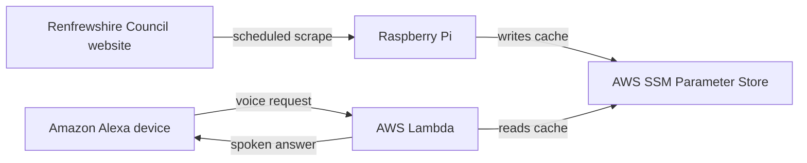

# Renfrew-Yoker Bridge Checker

Check when the **Renfrew-Yoker bridge** is closed by asking **Amazon Alexa**.

Renfrewshire Council publish bridge closure times on their website at the following
page: https://www1.renfrewshire.gov.uk/article/14478/Check-when-Renfrew-Bridge-is-closed-to-vehicles-pedestrians-and-cyclists

---

## Table of Contents

- [How it works](#how-it-works)
- [Requirements](#requirements)
- [Installation](#installation)
- [Testing](#testing)
- [Project Structure](#project-structure)
- [Tooling](#tooling)
- [Contributing](#contributing)

---

## How it works

A few constraints shaped the design:

- **Renfrewshire council does not publish the required data via an API.** At the time of
  developing this project, there is no API for bridge closure data, only an HTML page,
  so an automated check must scrape it.
- **Alexa allows 8 seconds to respond.** Scraping a live page inside the voice request
  service is too slow and too fragile. Caching the result decouples response latency
  from scrape latency entirely.
- **Renfrewshire council's website sits behind Cloudflare.** Requests from AWS's
  datacenter IP ranges get blocked. A Raspberry Pi on a residential connection is
  treated as ordinary traffic, which removes the need for a scraping proxy.
- **A scraping proxy was the first attempt, and it wasn't viable.** ScraperAPI bills 40
  credits per Cloudflare-protected fetch rather than 1, so the free tier ran dry at any
  useful refresh cadence. The Raspberry Pi replaced it and costs virtually nothing to
  run.



A Raspberry Pi on home broadband scrapes the bridge closures page on a systemd timer and
writes the parsed closures to **AWS SSM Parameter Store** - a managed key-value store,
used here purely as a small, durable cache. The Alexa-facing Lambda only ever reads that
cache, so it answers in milliseconds regardless of how long the last scrape took.

The scheduled refresh and the voice handler are deliberately kept as separate
deployables. They fail independently: a scrape that breaks leaves the last good cache in
place, and Alexa keeps answering.

---

## Requirements

- [Git](https://git-scm.com/downloads)
- [Python 3.14](https://www.python.org/downloads/)

---

## Installation

```bash
# Clone the repository:
git clone https://github.com/gregor-mcintyre/renfrew-yoker-bridge-checker.git

# Create a virtual environment:
py -3.14 -m venv .venv

# Activate the virtual environment depending on your operating system:
.venv\Scripts\activate # Windows
source .venv/bin/activate # macOS/Linux

# Install the project's development dependencies:
pip install -e ".[dev]"

# Wire up git hooks so linting/formatting/type-checks run on every commit:
pre-commit install
```

---

## Testing

Tests follow a three-tier model - unit, integration, and end-to-end - described in full
in `CLAUDE.md`.

---

## Project Structure

There is no single importable package. The project is a set of independent deployment
roots - one top-level directory per target runtime (a Raspberry Pi systemd timer, an AWS
Lambda zip), each flat-imported the way that runtime expects. The `pythonpath` setting
in `pyproject.toml` lets the tests import across those roots without a `src/` layout.

---

## Tooling

On every `git commit`, Ruff (lint + format), mypy (type-checking) and vulture (dead
code) run automatically via pre-commit. They report issues without auto-fixing. If a
hook fails, fix the flagged lines by hand, re-stage, and re-commit.

```bash
# Run everything manually against all files:
pre-commit run --all-files
```

Actual settings live in `pyproject.toml` and `.pre-commit-config.yaml`. See `CLAUDE.md`
for the naming, docstring and testing conventions this project follows.

---

## Contributing

This project uses the **Git Flow** branching model where each branch has a unique
purpose ([see more on this later](#branch-structure)).

### Prerequisites

- The `git-flow` extension installed ([see below](#initialising-git-flow))

### Installing Git Flow

Follow the official installation guide for your platform:
[git-flow installation instructions](https://github.com/nvie/gitflow/wiki/Installation)

Verify the install:

```bash
git flow version
```

### Initialising Git Flow

From the root of the repository, run:

```bash
git flow init
```

You'll be prompted to name each branch type. **Accept the defaults** for consistency
with the rest of the team:

```
Branch name for production releases: [main]
Branch name for "next release" development: [develop]
Feature branch prefix: [feature/]
Release branch prefix: [release/]
Hotfix branch prefix: [hotfix/]
Support branch prefix: [support/]
Version tag prefix: []
```

### Branch Structure

| Branch      | Purpose                                                                                                                                           |
|-------------|---------------------------------------------------------------------------------------------------------------------------------------------------|
| `main`      | Production-ready code only. Every commit here is deployable and typically tagged with a release version.                                          |
| `develop`   | The integration branch for ongoing work. All finished features land here before a release is released.                                            |
| `feature/*` | Short-lived branches for individual features, backlog items, or bug work. Branched from and merged back into `develop`.                           |
| `release/*` | Created when preparing a new version. Used for final stabilisation, version bumps, and release-only fixes. Merged into both `main` and `develop`. |
| `hotfix/*`  | Urgent, isolated fixes for production issues. Branched from `main`, merged into both `main` and `develop`.                                        |

### Workflow

#### Feature Branches

Use for new features.

```
# Create a new feature
git flow feature start <feature-name>

# Publish it so it is visible to others
git flow feature publish <feature-name>

# Or pull another feature
git flow feature pull origin <feature-name>

# Commit and push as you go
git commit -m "Add feature description"
git push

# Finish the feature (merges into develop and deletes the feature branch)
git flow feature finish <feature-name>
git push
```

#### Release Branches

Use when preparing a new version for deployment. A release branch can bundle one or more
completed features.

```
# Create a new release
git flow release start <0.1.2>

# Publish it so it is visible to others
git flow release publish <0.1.2>

# Make any last-minute release fixes directly on the release branch
git commit -m "Final fixes for release v0.1.2"
git push

# Finish the release (merges into main and develop, and tags the release)
git flow release finish <0.1.2> -m "Release v0.1.2"
git push

# Resolve any merge conflicts, then push
git push

# Push the tagged release
git checkout main
git push --tags
```

#### Hotfix Branches

Use for urgent production fixes.

```
# Create a hotfix from main
git flow hotfix start <hotfix-name>

# Publish it so it is visible to others
git flow hotfix publish <hotfix-name>

# Or pull another hotfix
git pull origin hotfix/<hotfix-name>

# Commit and push as you go
git commit -m "Fix critical issue"
git push

# Finish the hotfix (merges into main and develop, and tags the release)
git flow hotfix finish <hotfix-name> -m "Hotfix v0.1.2"
git push

# Resolve any merge conflicts, then push
git push

# Push the hotfix release
git checkout main
git push --tags
```

### More Information

- [Branching Model](https://endjin.com/blog/a-step-by-step-guide-to-using-gitflow-with-teamcity-part-2-gitflow-a-branching-model-for-a-release-cycle)
- [A successful Git branching model](http://nvie.com/posts/a-successful-git-branching-model/)
